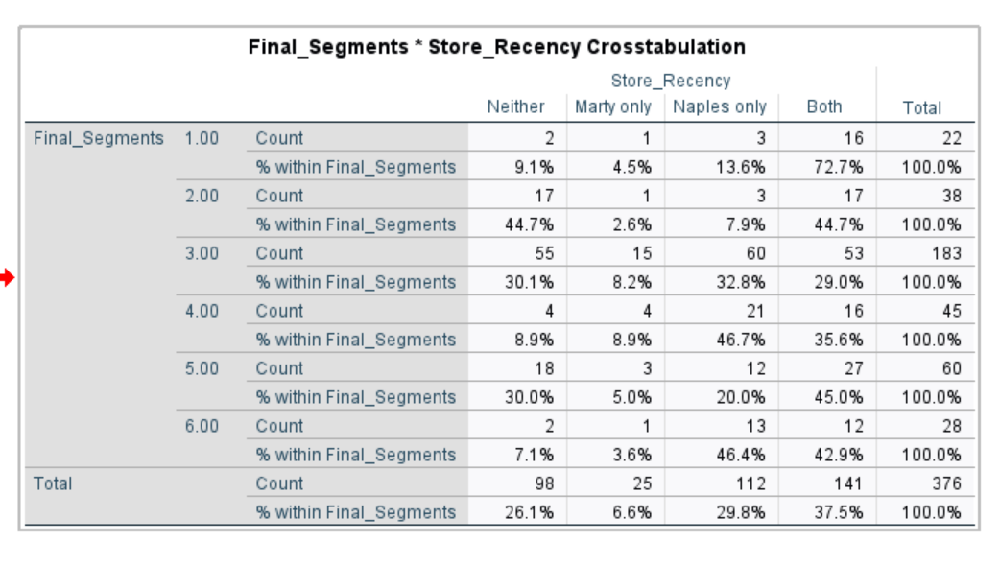

# Marty-s-Store-SPSS-Analysis

Data Cleaning
The dataset began with 447 entries. I eliminated 71 rows (resulting in 376 entries) based on the following conditions:
- Several duplicates in same user ID and all their answers (so I was sure these were repetitive entries rather than a different entry mislabelled with the same user ID)
- Empty entries in any column (As I felt I had enough data and I preferred a cleaner dataset with no imputation)

Variables:

Market Factors(1-8) on a scale 1-5: Superior Service, Merchandise Quality, Merchandise Variety, Good Prices, Store Atmosphere, Convenient Location, Brand Names, Stylish Products

Martys/Naples Store Factors on scale 1-5: Market Factors 1-8, Value for Money, Strong Reputation, Fun to Shop, Helpful Employees

AgeNaples: Respondents perceived age of average Naples shopper

NaplesTV, NaplesPrint, NaplesRadio: Perceived amount of ads per channel for Naples store

ShopNaples: Did respondent shop at Naples in past 3 months

AgeMartys: Respondents perceived age of average Martys shopper

MartysTV, MartysPrint, MartysRadio: Perceived amount of ads per channel for Martys store

ShopMartys: Did respondent shop at Martys in the past 3 months

ShopClothing: How often did respondent shop in past month, option 1-6 (did not shop, 1-2, 3-4, 5-6, 7-8, 8+)

SpendClothing: How much did respondent spend in past month, options 1-6 (<$50, $50-99, $100-149, $150-199, $200-249, $250+)

Income: What was your personal income in the past year, options 1-5 (<$15000, $15000-29999, $30000-44999, $45000-59999, $60000+)

Age: current age of respondent, options 1-5 (<18, 19-24, 25-34, 35-44, 45+)

Sex: sex of respondent (M, F)

What does the market’s audience look like?

What do customers value?

Amongst the 8 market factors, merchandise quality, merchandise variety, good prices, superior service and stylish products rated highly (more than 4)

In comparison, the market tended to value store atmosphere, convenient location and brand names less.

Looking at the demographic of the market:

The largest income group (46.3%) of respondents had a personal income of $15,000-29,999, followed by 21.5% making less than $15,000.

The two main groups of respondents in age were of 35-44 years old (31.4%) and 19-24 years old(25.5%).

In terms of sex distribution, the respondent pool skewed towards women (59%).

Spending habits of the market(of shoppers in the last three months):
Most of the market(65.7%) shopped 3-4 times or less in the past month and spent between $100-$199(60.6%).

What are the current brands images of the case company(Martys) and the competitor company(Naples)?

Those who did not shop in the past 3 months were included as they can provide insight on the marketing image of these brands.

Naples:

The top three highly rated factors for Naples is convenient location, strong reputation, and good prices. In contrast, their weakest factor performance is in merchandise variety(3.63). Their average rating amongst all factors is 3.88. Respondents felt the mean age for Naples shoppers was 19.77.

Martys: 

The top three highly rated factors for Martys is convenient location, good prices, and value for money. Their weakest factor performance is in brand names. Their average rating over all factors is 3.48.The mean perceived age for Martys shoppers is 28.50

Generally speaking, Naples is seen as a more high quality store that is a well established chain catering to the young generation whereas Martys caters to an older generation.

Segmentation:

I segmented the market of clothing consumers based on frequency in the past month(low: 0-2 times, med: 3-6 times, high: 7 or more times) and spending(low: $0-99, med: $100-199, high: $200+). This created 9 segments. To condense the amount of segments, I combined the medium and high frequency groups with low spending,low and medium frequency with medium spend, and low and medium frequency for high spend. These decisions were made on the factors valued amongst the 8 market factors and segment closeness in the frequency-by-spending grid, and demographic factors such as income, age and sex distribution.

Additionally, all segments valued merchandise quality and variety hence segments below are noted based on other unique factors. 
Below are the final segments:

Segment 1: low spending, low frequency
- Younger customers valuing convenient location and good prices
- Age: 18-24, income: $0-29999, sex is relatively equally distributed

Segment 2: low spending, medium-high frequency:
- Customers valuing merchandise variety and quality
- Age: 18-24, income: $15000-44999, sex distribution is slightly female leaning

Segment 3: medium spending, low-medium frequency:
- Middle-aged female-leaning customers that are price-conscious
- Age: 25-44, income: $15000-44999, more female-leaning and lower mean income than Group 2

Segment 4: medium spending, high frequency:
- Higher income young adult valuing superior service and stylish products
- Age: 19-34, income: $15000-44999, relatively equal sex distribution

Segment 5: high spending, low-medium frequency:
- Middle-aged, high income, male-leaning price-conscious group
- Age: 35 or older, income: $15000-44999, male-leaning sex distribution

Segment 6: high spending, high frequency:
- Older, high income, male dominant customers valuing stylishness
- Age: 35 or older, income: $15000-44999, generally older than Group 5

What segments should Martys target?

Segment 1 was excluded from consideration as it was not a priority due to the small size of the segment as well as the low amount of spending whether there was high or low frequency. 

I used pair t-tests to look at how each segment felt both stores performed on their valued factors, using the additional 4 (Value for money, strong reputation, fun to shop, helpful employees) as extra information rather than deciding factors. As a result, I found segment 6 and 5 were easiest to adjust and remain competitive for. Naples generally outperformed in the additional 4 factors for all segments except for segment 6 factor ¼ (value for money).

I also looked at the size of each segment and created a cross-tabulation to look at how much of the market was captured by Martys and Naples per segment. The size of segments alluded to segment 3(49% of respondents) having the most opportunity. From the cross-tabulation, segment 2(44.7%), 3(30.1%), and 5(30%) seemed to have the most market still available to capture without Naples dominating the market which is important because Martys had weaker performances in terms of store factors so I felt the ability to take from the competitor, Naples, customers were lower.

(TestOfAssocToSpend File)

Additionally, I tested how the frequency of shopping and demographic factors (age, sex, income) related to the spending amount to understand what factors in each segment I should weigh more heavily depending on correlation with higher spending. Amongst all these factors, Age was the only significant factor. Hence, segments like 5 or 6 might be more appealing given this evidence.

Based on this evidence, I would recommend segment 5 as a target priority, followed by segment 3 and 6 as secondary priorities.

Segment 5 has older customers, associated with higher spending, a realistic store offering adjustment for Martys, and has a high market share available for capture.

Segment 3 possesses great opportunity in the large market share available (49%), but Martys would require a much more aggressive adjustment in positioning to become competitive in that segment. 

Segment 6 possess a high age demographic correlated with higher spending and a segment that Martys is relatively competitive in. However, a large portion of the market(46.4%) belongs solely to the competitor company and the size of the segment is small compared to the other notable segments.

Therefore, segment 5 has the highest value for effort whereas segment 3 and 6 still have high opportunity but are much more costly investments.

MARKETING CHANNELS:

For each segment, I tested whether the reach of each channel(TV, print, radio)  for both stores was significantly different between each segment compared and the rest of the respondents using a t-test. Additionally, I tested whether the reach of the case company compared to the competitor’s was significantly different through paired t-tests.

Segment 5:

For segment 5, Martys outperformed Naples in merchandise variety and matched Naples in good prices. However, Naples outperformed Martys in terms of merchandise quality.
This segment showed higher exposure to Naples’s print and radio compared to those not in the segment. 
Martys’s TV and print exposure was lower than Naples's in this segment.
To better target this segment, Martys needs to prioritize improving their merchandise quality, improve print channel reach, perhaps by observing what Naples is doing well in this segment. 

Segment 3:

I found that those in the group were reached significantly less than those outside the segment in regards to the TV channel for Naples.

Additionally in the paired t-test I discovered that Martys’s had less reach than Naples in terms of TV and print. However, assuming that TV is not as effective in reaching this segment, Martys needs to focus on increasing the volume of marketing through print and radio to better target this segment.

Segment 6:

This segment had significantly less exposure to radio, specifically Naples, in comparison to those not in the segment. 

Additionally, Naples’s TV was exposed to this group much more than Martys’s TV, but Martys’s radio was exposed more than Naples’s radio.

Martys’s radio had no significant difference in exposure between the segment and non-segment group so I don’t believe there is a reason to lessen nor increase funding in this part. However, Martys should focus on improving their TV channel to better target this group.

FINAL RECOMMENDATIONS: 

Segment 5 (primary priority): 

This is a high spend, low-medium frequency and male dominant segment, Martys’s can focus on creating loyalty programs to increase the frequency of shopping focused and promote popular male products through channel marketing. Furthermore, Martys needs to prioritize improving their merchandise quality, and improve print channel reach.

Segment 3 (secondary priority):

This segment is a low-medium frequency, medium spend, and female. Martys can increase the frequency using a similar loyalty program previously mentioned for segment 5. Martys needs to improve their performance in good prices, merchandise quality, and print and radio channels to better target this segment.

Segment 6 (secondary priority):

This segment is older, higher income and cares about stylish products in addition to quality and variety. Martys’s did not significantly underperform in any key factors but underperforms in terms of TV marketing reach in comparison to Naples. Since in this segment market, a large portion(46.4%) shop solely at Naples, with only 7.1% not shopping at either, Martys should focus on offerings that target new customers or those that have not shopped at Martys yet such as first-time shopper offers. Taking into consideration this segment cares for style, they could bundle first-time shopper offers with new clothing releases.
